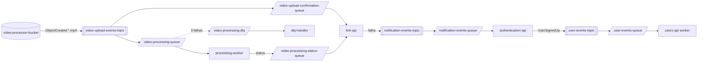

# iac-video-processor-infra

Infraestrutura **compartilhada** da plataforma de processamento de vídeos do Tech Challenge FIAP X (Fase 5 — Hackathon, 13SOAT), provisionada com **Terraform**. Este repositório é o dono da fundação sobre a qual todos os microsserviços rodam: VPC, cluster EKS, repositórios ECR, tópicos SNS / filas SQS, buckets S3 do pipeline de vídeo, o segredo compartilhado `jwt-signing-key` e a observabilidade Datadog do cluster.

Repositório correspondente na organização: [`iac-video-processor-infra`](https://github.com/13SOAT-andromeda/iac-video-processor-infra).

---

## 1. Onde este repositório se encaixa na plataforma

Este é o **primeiro repositório a ser aplicado** em uma conta nova (ver [`docs/RUNBOOK.md`](docs/RUNBOOK.md)) — todos os outros dependem dos recursos e outputs daqui:

| Repositório | Responsabilidade | Relação com este repositório |
|---|---|---|
| [`iac-video-processor-data`](https://github.com/13SOAT-andromeda/iac-video-processor-data) | RDS (users) + DynamoDB (`auth-credentials`, `Links`, `LinkEvents`) | Provisiona o RDS **dentro da VPC criada aqui** |
| [`iac-video-processor-gateway`](https://github.com/13SOAT-andromeda/iac-video-processor-gateway) | API Gateway HTTP API + REQUEST authorizer | Descobre a VPC/subnets daqui via data source e roteia via VPC Link para o ALB do Ingress |
| `video-processor-authorizer` / `video-processor-authentication-api` | Login/signup (Lambda) + validação de JWT (Lambda) | Usam os ECRs `authorizer`/`authentication` e o segredo `jwt-signing-key`; o signup publica no tópico `user-events` criado aqui |
| [`video-processor-users-api`](https://github.com/13SOAT-andromeda/video-processor-users-api) | API de perfil de usuários + worker de signup (pods EKS) | Usa o ECR `users-api`, roda no node group do EKS, consome a fila `user-events` e o path `/api/users` do Ingress |
| [`video-processor-link-api`](https://github.com/13SOAT-andromeda/video-processor-link-api) | Links de upload/download (pod EKS) | Usa o ECR `link-api`, o path `/api/links` do Ingress e consome as filas `video-processing-status` e `video-upload-confirmation` |
| `video-processor-converter` | Worker de processamento de vídeo (ffmpeg) + DLQ handler | Usa o ECR `worker`, o bucket de vídeos, as filas `video-processing`/`video-processing-dlq` e o bucket de artefatos |

---

## 2. O que é provisionado

### Rede e computação

- **VPC** `video-processor-vpc` (`10.0.0.0/16`, 2 AZs `us-east-1a`/`b`), com subnets públicas e privadas taggeadas para o AWS Load Balancer Controller, NAT Gateway único ([`prod/vpc.tf`](prod/vpc.tf)).
- **EKS** `video-processor-eks-<env>` (Kubernetes 1.31, endpoint público + privado), com node group `users` (`t3.medium`, 1–2 nós) nas subnets privadas ([`prod/eks.tf`](prod/eks.tf)). O node group usa um **launch template** próprio ([`prod/launch_template.tf`](prod/launch_template.tf)) que fixa o hop limit do IMDSv2 em 2 — necessário para pods (ex.: Datadog Agent) alcançarem o IMDS e assumirem a `LabRole` (não há IRSA na conta AWS Academy: `iam:CreateRole` é negado).
- **IAM**: nenhuma role é criada — tudo usa a `LabRole` pré-existente do Learner Lab (via data source).

### ECR (5 repositórios — [`prod/ecr.tf`](prod/ecr.tf))

`video-processor-users-api-<env>`, `video-processor-authorizer-<env>`, `video-processor-authentication-<env>`, `video-processor-worker-<env>` e `video-processor-link-api-<env>` — todos com scan on push e lifecycle policy de reter as últimas 10 imagens.

### Mensageria (SNS/SQS — [`prod/messaging.tf`](prod/messaging.tf))

| Tópico/Fila | Produz | Consome | Observação |
|---|---|---|---|
| `video-processor-user-events-topic` → `…-queue` (+DLQ) | `authentication-api` (evento `UserSignedUp`) | worker do `users-api` | ADR-012 — única integração entre auth e users |
| `notification-events-topic` → `…-queue` (+DLQ) | `link-api` (falha de processamento) | `authentication-api` (envio de e-mail) | |
| `video-upload-events-topic` | S3 `ObjectCreated` `*.mp4` do bucket de vídeos | fan-out para as duas filas abaixo | S3 não aceita duas filas com o mesmo filtro de sufixo — o SNS resolve o fan-out; `raw_message_delivery = true` preserva o shape do evento S3 esperado pelo worker |
| `video-processing-queue` (+`video-processing-dlq`) | ↑ fan-out | processing-worker (`converter`) | visibility de 1800s cobre o ffmpeg; 3 falhas → DLQ → dlq-handler |
| `video-upload-confirmation-queue` | ↑ fan-out | `link-api` (`UPLOAD_PENDING → UPLOAD_COMPLETED`) | substitui o antigo callback HTTP de confirmação de upload |
| `video-processing-status-queue` | processing-worker / dlq-handler | `link-api` (estado do link) | sem DLQ própria por decisão de arquitetura (ADR-003, adendo v5) |



### Storage (S3 — [`prod/storage.tf`](prod/storage.tf))

- `video-processor-bucket-<env>` — uploads `.mp4` brutos (disparam a notificação para o tópico de fan-out) e `.zip` de frames processados em `processed/` (o filtro por sufixo `.mp4` evita que o `.zip` re-dispare o worker).
- `video-processor-artifacts-<env>` — artefatos de deploy (zips do dlq-handler publicados pelo CD do `converter`).

### Secrets ([`prod/secrets.tf`](prod/secrets.tf))

- `jwt-signing-key-<env>` (Secrets Manager) — segredo HS256 **gerado pelo Terraform** (`random_password`, 64 chars) e compartilhado por `authentication-api` (emite JWT), `authorizer` e `users-api` (validam). Os outros repos o resolvem por nome via `data.aws_secretsmanager_secret`.

### Observabilidade (Datadog — só em `prod/`)

- [`prod/datadog.tf`](prod/datadog.tf) — Datadog Agent (node Agent + Cluster Agent) via Helm chart oficial no cluster: APM (`portEnabled`), DogStatsD via hostPort, coleta de logs de todos os containers. A API key entra como secret do Kubernetes a partir da variável `datadog_api_key`.
- [`prod/datadog-log-forwarder.tf`](prod/datadog-log-forwarder.tf) — Lambda forwarder + subscription filters de CloudWatch Logs (Lambdas e access logs do API Gateway), atrás da flag `enable_downstream_log_forwarding` (exige os outros repos já aplicados).
- [`prod/datadog-dbm.tf`](prod/datadog-dbm.tf) — Database Monitoring do RDS `users-db`, atrás da flag `enable_postgres_dbm` (exige `iac-video-processor-data` aplicado e o setup de `dbm_setup.sql` executado).

### Kubernetes ([`k8s/ingress.yaml`](k8s/ingress.yaml))

Ingress **centralizado** (`ingressClassName: alb`, ALB interno, target-type `ip`, health check `/api/health`) roteando `/api/users` → `video-processor-users-api-svc` e `/api/links` → `video-processor-link-api-svc`. Aplicado via `kubectl` após o AWS Load Balancer Controller estar no ar (passo 4 do runbook) — não faz parte do state do Terraform.

---

## 3. Estrutura de pastas

```
prod/                    ambiente real na AWS (Academy Learner Lab)
  main.tf                providers, backend S3 (bucket parametrizado), LabRole
  vpc.tf                 VPC 2 AZs + subnets taggeadas p/ ALB Controller
  eks.tf                 cluster EKS 1.31 + node group users
  launch_template.tf     hop limit IMDSv2 = 2 (fix p/ Datadog Agent ⇄ LabRole)
  ecr.tf                 5 repositórios ECR
  messaging.tf           tópicos SNS + filas SQS do pipeline (ver §2)
  storage.tf             buckets de vídeo e de artefatos
  secrets.tf             jwt-signing-key (Secrets Manager)
  datadog*.tf            Agent via Helm, log forwarder, DBM
  tests/                 testes nativos do Terraform (terraform test)
dev/                     espelho local via LocalStack (sem Datadog — ver nota em dev/main.tf)
k8s/ingress.yaml         Ingress ALB centralizado (/api/users, /api/links)
docs/RUNBOOK.md          deploy completo da plataforma numa conta zerada
docs/superpowers/        specs e planos de design (infra, messaging ADR-012, jwt secret)
```

---

## 4. Aplicando na AWS (`prod/`)

### Pré-requisitos

- Terraform >= 1.11
- Credenciais válidas da sessão do AWS Academy Learner Lab em `~/.aws/credentials`
- API key do Datadog exportada (`DD_API_KEY`)
- Bucket S3 de state já criado (nome sufixado com o account ID — a conta do Lab reseta periodicamente e nomes de bucket são globais; ver passo 1 do runbook)

### Passo a passo

```bash
cd prod
terraform init -input=false -reconfigure -backend-config="bucket=${STATE_BUCKET}"
terraform apply -input=false -auto-approve -var="datadog_api_key=${DD_API_KEY}"
```

Demora ~10–12 min (EKS control plane + node group). Na sequência, siga o [`docs/RUNBOOK.md`](docs/RUNBOOK.md) para o AWS Load Balancer Controller, o Ingress (`k8s/ingress.yaml`) e os demais repositórios.

> **Ordem importa:** as flags `enable_downstream_log_forwarding` e `enable_postgres_dbm` devem ficar `false` no primeiro apply (os log groups e o RDS que elas referenciam ainda não existem) e ser ligadas depois que `gateway`/`authorizer`/`authentication` e `data` estiverem aplicados.

### Variáveis ([`prod/variables.tf`](prod/variables.tf))

| Variável | Default | Uso |
|---|---|---|
| `environment` | `prod` | sufixo de nomes e tag `Environment` |
| `region` | `us-east-1` | região AWS |
| `datadog_api_key` | — (obrigatória, sensível) | secret do Cluster Agent + log forwarder; nunca commitar — usar `TF_VAR_datadog_api_key` |
| `datadog_site` | `datadoghq.com` | site do Datadog |
| `enable_downstream_log_forwarding` | `false` | liga subscription filters de logs (exige gateway/lambdas aplicados) |
| `enable_postgres_dbm` | `false` | liga o check Postgres do Cluster Agent (exige RDS + `dbm_setup.sql`) |
| `postgres_dbm_host` / `postgres_dbm_port` / `postgres_dbm_dbname` | `""` / `5432` / `usersdb` | endpoint do RDS, só com DBM ligado |

### Outputs principais ([`prod/outputs.tf`](prod/outputs.tf))

`cluster_name`, `vpc_id`, URLs dos ECRs (`users_api`, `link_api`, `worker`), ARNs/URLs de todos os tópicos e filas, `jwt_signing_key_secret_name`/`arn`, `video_processor_bucket_name` e `artifacts_bucket_name` — consumidos pelos workflows de deploy e pelos Terraform dos outros repositórios.

---

## 5. Rodando localmente (`dev/` — LocalStack)

O diretório [`dev/`](dev) espelha a infraestrutura contra o **LocalStack** (`localhost:4566`, credenciais `test`/`test`), com backend S3 também no LocalStack. Sem Datadog — a emulação de EKS do LocalStack Community não roda control/data plane reais, então um Agent via Helm não teria onde rodar (ver nota em [`dev/main.tf`](dev/main.tf)).

```bash
# com o LocalStack no ar e o bucket de state criado nele:
cd dev
terraform init
terraform plan
terraform apply
```

---

## 6. Testes

Testes nativos do Terraform (`terraform test`) em [`prod/tests/`](prod/tests):

```bash
cd prod
terraform init -backend=false
terraform test
```

- [`infra_unit_test.tftest.hcl`](prod/tests/infra_unit_test.tftest.hcl) — asserts sobre VPC, EKS, ECR, mensageria, storage e secrets.
- [`datadog_unit_test.tftest.hcl`](prod/tests/datadog_unit_test.tftest.hcl) — asserts sobre o Agent/Helm, forwarder e DBM.

---

## 7. Decisões e limitações relevantes

- **AWS Academy Learner Lab**: a conta reseta periodicamente (novo account ID, tudo apagado). O runbook parte de conta zerada e nada é hardcoded de sessões anteriores. `iam:CreateRole` é negado — tudo roda com a `LabRole` (sem IRSA), o que motivou o hop limit 2 do IMDSv2 no launch template.
- **Fan-out SNS do upload** (`video-upload-events-topic`): o S3 não permite dois destinos SQS com o mesmo filtro de sufixo na mesma notification config; o tópico único replica o `ObjectCreated` para worker e link-api, com `raw_message_delivery = true` para manter o payload S3 cru que o worker espera.
- **`jwt-signing-key`**: gerado aqui e lido por nome pelos repos consumidores — nenhum serviço emite ou valida JWT com segredo próprio.
- **Ingress fora do Terraform**: o `k8s/ingress.yaml` depende do AWS Load Balancer Controller (instalado via Helm no runbook), por isso é aplicado com `kubectl` e não entra no state.
